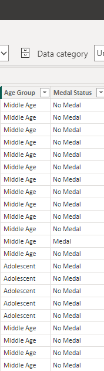
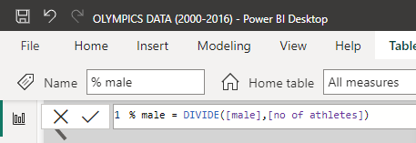
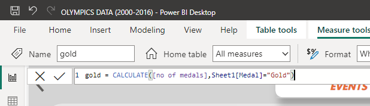
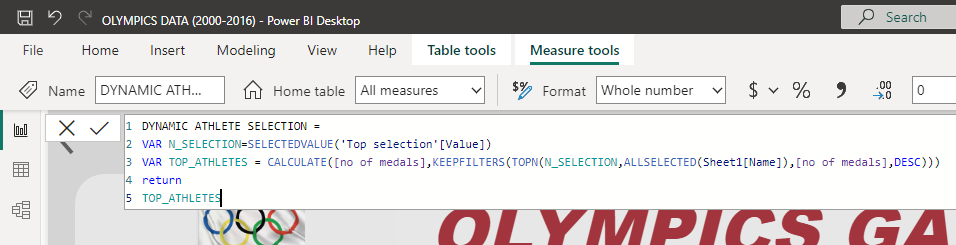
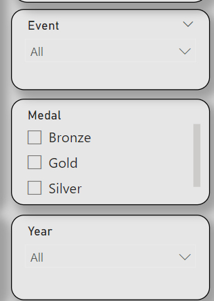
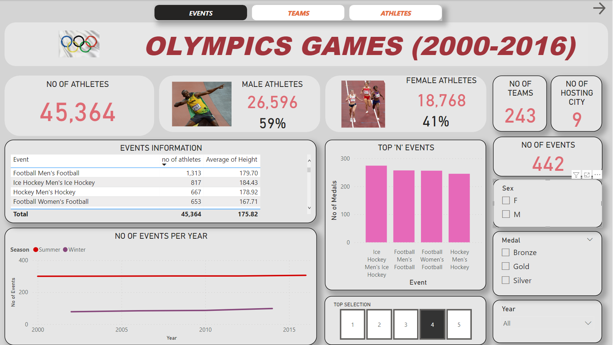
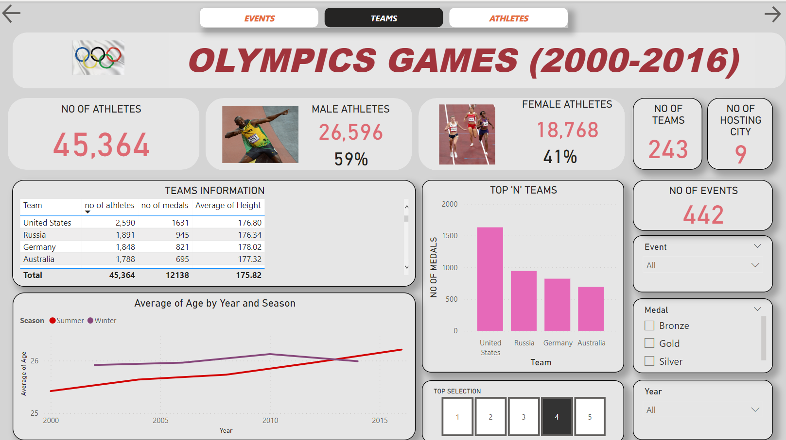
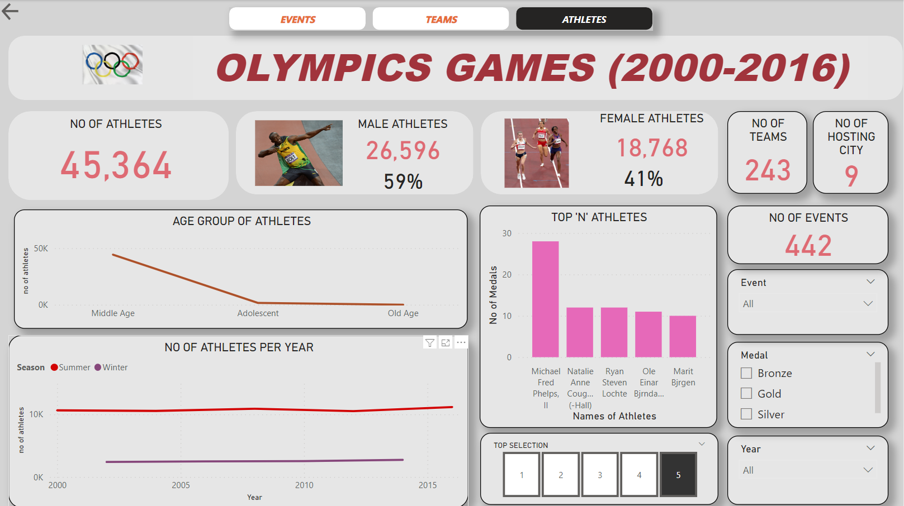
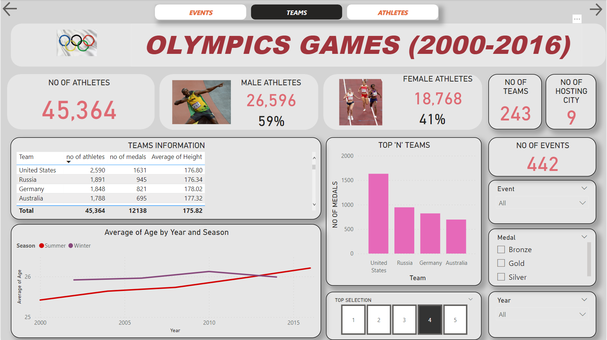
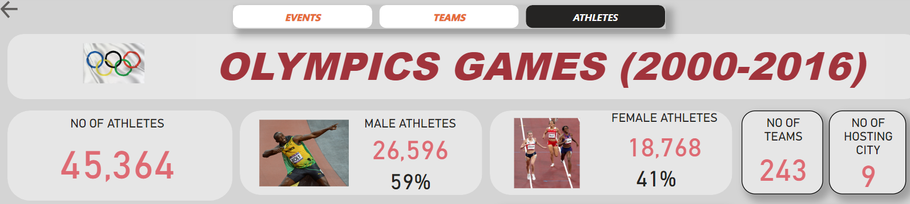

# OLYMPICS PROJECT (2000-2016)

## INTRODUCTION

Welcome to the data analysis project report on the Olympics dataset. In this report, I explored and analyzed a comprehensive collection of data from various Olympic Games, spanning a significant period of time. The Olympics is the pinnacle of international sporting events, bringing together athletes from around the world to compete in a wide range of sports. By examining this rich dataset, we aim to uncover meaningful insights, patterns, and trends that can enhance our understanding of the Olympics and its impact on athletes, countries, and the world of sports.

The Olympics dataset provided a wealth of information, including details about participating countries, athletes, events, results, and historical context. This extensive dataset offers an excellent opportunity to delve into various aspects of the Olympic Games, such as medal distribution, participation trends, performance analysis, and much more. By conducting a thorough analysis of this dataset, I got valuable insights into the evolution of the Olympics over time, as well as identify factors that contribute to success in different sports disciplines.

Throughout this report, we will employ various data analysis techniques, statistical methods, and visualization tools to interpret the dataset and present my findings in a clear and concise manner. Our objective is to extract actionable insights that can be utilized by sports organizations, policymakers, and sports enthusiasts to improve athlete performance, enhance training strategies, and inform decision-making processes related to the Olympics.

The structure of this report will follow a logical sequence, starting with data preprocessing and cleaning, followed by exploratory data analysis, and concluding with a comprehensive interpretation of my findings. I also highlighted  limitations and suggestions.

## DATA SOURCE
The dataset was gotten from Kaggle

## PROBLEM STATEMENT
1.	What are the overall trends in the number of participants and events over the years?
2.	Which country has the highest number of medals overall? How does the distribution of medals vary across different countries?
3.	Are there any significant differences in the number of participants and medals between the Summer and Winter Olympics?
4.	How does the average age of participants vary over the years? Are there any noticeable patterns?
5.	Is there a correlation between height and the likelihood of winning a medal? Do taller athletes have a higher chance of winning?
6.	who are the top athletes with the most medals?
7.	what are the top events with the most medals?
8.	what are the top teams(country) with the most medals?
9.	How does the distribution of medals vary across different events? Which events have the highest and lowest number of medals awarded?
10.	Can we identify any age groups that tend to perform exceptionally well in specific events?

## DATA CLEANING AND TRANSFORMATION
The datasets was initially for 120 years (1896-2016). I made an intentional decision reduce the data  for 16 years and make tge dataset range from 2000-2016. 

On reducing the dataset, i needed to do some cleaning and transformation and make the dataset ready for analysis. 
To deal with missing values, the dataset was sorted based the year, season and events(in that order), and a fill down was used to fill in the missing values( since the dataset has been sorted based on the year and events) for the height and weight column. 

The age column has a 6% of missing values and the rows were dropped.

The medal column was transformed by changing the 'NA' value to No medal

News columns were created and they include; Medal status and Age group

The medal status column show if the athlete collected a medal or not regardless of which medal it was.

Due to the large age range we've got, three(3) age groups were created which were adolescents (10-17 years), middle age (18-59years)and the old age(above 60 years).

Some teams names had numbers infront of them and i replaced it with 'nothing'.

## EXPLORATORY ANALYSIS
On understanding the problem statement and having an idea of the information I will be needing grom the data, I started creating new measures I will be needing for the analysis with the use of DAX
The following measures were created;
1.	No of athletes: total number of atheletes

3.	Male: total number of male athletes

5.	Female: total number of female athletes
6.	%male: percentage of male athletes

8.	%female: percentage of female athletes
9.	Gold: Number of gold medal

11.	Silver: number of silver medal
12.	Bronze: number of bronze medal 
13.	no of medals: total number of medals 
14.	no of no medals: total number with no medals
15.	dynamic selection of teams: dynamic selection of the top (1-5) teams with the highest number of medals
16.	dynamic selection of events: dynamic selection of the top (1-5) events with the highest number of medals
dynamic selection of athletes: dynamic selection of the top (1-5) athletes with the highest number of medals

Slicers were created to filter out the needed insights from the data and the slicers created included; events, type of medal, and the year

The visualisation was divided into 3 parts to get information about the teams, events and the athletes across the years.

Events                  | Teams              | Athletes
:----------------------:|:-------------------:|:-------------:
||

Page navigation buttons were created for easy navigation across the 3 pages.

You can interact with the report here

## DATA INSIGHTS
N.B The insights generated below are the general information gotton from our data without the use of filters or slicers (further insight can b generated with the use of filters and slicers across all the visualizations).
1.	The total number of athletes that took part in the Olympics was 45,364 of which 59% were male and 41%  were female.
2.	The total number of teams was 243 
3.	The total number of hosting cities throughout across the whole period was 9.
4.	The total number of events was 442. 

6.	The total number of athletes differs between the 2 seasons. The summer season had between 10,000-11,200 number of athletes while the winter has between 2,000 and 3,000 athletes participating in the Olympics.
7.	The top (1-5) countries with the highest number of medals were United States (G-700, S-519, B-412), Russia (G-320, S-270, B-355), Germany (G-284, S-238, B-299), Australia (G-186, S-262, B-247), China (G-283, S-190, B-182).
8.	The top (1-5) athletes with the highest amount of medals were Micheal Fred Phelps from United States with 28 medals, Natalie Anne Coughing from United States with 12 medals, Ryan Steven Lochte from United States with 12 medals, Ole Einar Bjrndalen from United States with 11 medals and Marit Bjrgen from Norway with 10 medals.
9.	The top (1-5) events with the highest number of medals were Men's ice hockey with 274 medals, Men's football with 257 medals, Women's football with 256 medals, Men's hockey with 245 medals, Women's hockey with 240 medals and Women's ice hockey with 240 medals.
10.	There was no significant difference in the average age over the years.
11.	The middle age group tends to perform more due to the fact that the have higher number of participants compared to other age groups.

## RECOMMENDATION
To further enrich our understanding of the Olympic Games and support evidence-based decision-making, it is crucial to continue collecting and analyzing comprehensive data. Olympic committees, governing bodies, and researchers should collaborate to establish standardized data collection protocols and share data openly. This will enable ongoing analysis, benchmarking, and the identification of emerging trends that can inform future policy-making and strategic planning.
